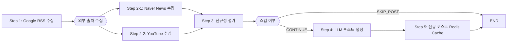

# WEB4_5_GAEPPADAK_BE

### 꼬끼오(KKokkio) - 뉴스 속보 및 트렌드 알림 서비스

> Programmers 백엔드 데브코스 4기 5회차 4팀 **최종 프로젝트** <br> _Real-time multi-source trend aggregation & summarization platform_

<br>

---

## 👥 Team Introduction

|  |  |  |  |  |  |
| :--------------------------------------------------------------------------: | :--------------------------------------------------------------------------: | :--------------------------------------------------------------------------: | :--------------------------------------------------------------------------: | :--------------------------------------------------------------------------: | :---------------------------------------------------------------------------: |
|   이하은 <br> [haeun9988](https://github.com/haeun9988) <br> Product Owner   |  이화영 <br> [2hwayoung](https://github.com/2hwayoung) <br> Backend Leader   |          김경래 <br> [godaos](https://github.com/godaos) <br> 비고           |          김하연 <br> [xaxeon](https://github.com/xaxeon) <br> 비고           |  이태경 <br> [dlfjsld1](https://github.com/dlfjsld1) <br> AWS Administrator  |       윤상민 <br> [skvhffpdyd](https://github.com/skvhffpdyd) <br> 비고       |

<br>

---

## 📊 Project Overview

### 프로젝트 이름: **꼬끼오(KKokkio)**

다양한 뉴스 채널의 실시간 속보 데이터를 수집하고, 급상승 트렌드 키워드와 주요 이슈를 탐지하여 사용자에게 여론의 흐름을 시각화하고 요약·알림을 제공하는 서비스입니다.

### 기획 의도

알고리즘 기반 개인화 서비스로 인한 **확증 편향(Confirmation Bias**)과 **에코챔버(Echo Chamber)** 현상을 완화하기 위해, “많은 사람이 동시에 주목하는 이슈”에 기반한 뉴스를 균형 있게 노출합니다.

- 실시간 인기 검색어 기반으로 현재 사회적 관심사를 한눈에 파악
- 개인화 추천의 편향을 줄이고, 다양한 관점의 정보를 탐색하도록 유도
- SNS(인스타·유튜브 숏폼 등) 확장 가능성을 고려한 키워드 중심 설계

### 기술적 목표

> **“실시간 대용량 외부 데이터를 안정적으로 수집·가공·전달하는 백엔드 파이프라인 구축”**
>
> - Google Trends·NewsAPI·YouTube API 등 실시간 외부 데이터 연동
> - Spring Batch 스케줄링을 활용해 데이터 수집 및 전처리 워크플로우 자동화
> - LLM(Gemini·chatGPT·Claude) 활용 AI 요약 기능 내재화

<br>

---

## 🚀 핵심 기능 (Key Features)

| 기능                      | 설명                                                                |
| ------------------------- | ------------------------------------------------------------------- |
| 🔑 **실시간 키워드 수집** | Google Trends RSS에서 매시간 인기 키워드 Top-10 수집                |
| 📺 **연관 출처 매칭**     | Naver News & YouTube API로 뉴스·영상 10건씩 연결                    |
| 📰 **AI 포스트 생성**     | 각 키워드에 대해 Gemini / chatGPT / Claude 로 요약 포스트 자동 작성 |
| 💬 **댓글 & 리액션**      | 로그인 사용자의 댓글 CRUD, 좋아요, 신고                             |
| 🛠 **관리자 RBAC**         | 회원·포스트·댓글·신고 통합 관리 대시보드                            |

<br>

---

## 🌐 서비스 접속 주소 (Endpoints)

### 꼬끼오 웹사이트: https://web.kkokkio.site/

> 아래는 배포된 백엔드 서버의 접속 주소입니다.
>
> | 환경     | API Base URL                      | Swagger UI                                              |
> | -------- | --------------------------------- | ------------------------------------------------------- |
> | **개발** | `https://api.deploy.kkokkio.site` | `https://api.deploy.kkokkio.site/swagger-ui/index.html` |
> | **운영** | `https://api.prd.kkokkio.site`    | `https://api.prd.kkokkio.site/swagger-ui/index.html`    |

<br>

---

## 🛠️ Technology Stack

### 🖥️ Backend & Infra

| Layer          | Stack & Version                                                   |
| -------------- | ----------------------------------------------------------------- |
| **Language**   | Java 21                                                           |
| **Framework**  | Spring Boot 3.4 · Spring Batch 5.2 · Spring Data JPA 3.4          |
| **Data**       | MySQL 8.0 · Redis 8                                               |
| **Monitoring** | Micrometer 1.14 · Prometheus 3.4 · Grafana 12                     |
| **CI/CD**      | GitHub Actions · Docker 28 · AWS ECR & RDS · NGINX · Flyway 10.20 |
| **Secrets**    | Doppler CLI                                                       |
| **IaC**        | Terraform 1.11                                                    |
| **Docs**       | Swagger 3.1                                                       |

### 🎨 Frontend

| Layer         | Stack & Version                                                                                                                         |
| ------------- | --------------------------------------------------------------------------------------------------------------------------------------- |
| **Framework** | Next.js 15                                                                                                                              |
| **Language**  | TypeScript 5.8                                                                                                                          |
| **WireFrame** | [FigZam 링크 바로가기](https://www.figma.com/board/T9dM5oVh1Gox1FVbHDyriL/%EA%B0%9C%EB%B9%A0%EB%8B%AD?node-id=0-1&t=KBHz7octPCnhTELP-1) |

### 📶 Open APIs & External Services

| Service           | Version / Notes             |
| ----------------- | --------------------------- |
| Google Trends RSS | -                           |
| Naver News API    | v1/search                   |
| YouTube Data API  | v3/search                   |
| ChatGPT LLM       | gpt-4o-mini(2024-07-18)     |
| Google Gemini LLM | gemini-2.0-flash            |
| Claude LLM        | claude-3-haiku-(2024-03-07) |

### 🛠 Dev & Collaboration Tools

| Tool          | Notes                                                                                           |
| ------------- | ----------------------------------------------------------------------------------------------- |
| IntelliJ IDEA | 2024.1 Ultimate                                                                                 |
| Gradle        | 8.14                                                                                            |
| GitHub        | -                                                                                               |
| Notion        | [Notion 페이지 바로 가기](https://www.notion.so/Team-04-1db3550b7b5580849242c1cd0985e39c?pvs=4) |
| Slack         | -                                                                                               |
| Discord       | -                                                                                               |
| Zep           | -                                                                                               |
| Google Meet   | -                                                                                               |

<br>

---

## 🏗️ 시스템 아키텍처 (System Architecture)


<br>

---

## 🛠 데이터 파이프라인 (Data Pipeline)



### 📑 요약 테이블

| 단계                         | 기술                  | 주요 작업                         | Metrics                         |
| ---------------------------- | --------------------- | --------------------------------- | ------------------------------- |
| **1. fetchTrendingKeywords** | Google Trend RSS      | RSS 파싱 후 Top10 키워드 수집     | -                               |
| **2. searchSources**         | NewsAPI/YouTube API   | 비동기 병렬 호출로 뉴스·영상 수집 | `fetched_total`, `failed_total` |
| **3. evaluateNovelty**       | Spring Batch Decider  | 중복·저변동 키워드 필터링         | `novelty_lowvar_total`          |
| **4. generatePost**          | Gemini/chatGPT/Claude | 프롬프트 → LLM 요약문 생성        | `post_added_total`              |
| **5. cachePost**             | Redis                 | Hot-Post 캐시 적재                | `post_cached_total`             |

### 모니터링 (Grafana)

> Grafana dashboard 템플릿은 [`infra/grafana/dashboard/batch.json`](infra/grafana/dashboard/batch.json) 참조 .


<br>

---

## ERD


<br>

---

## 🛠️ 개발 환경 설정 (Development Setup)

**1️⃣ Clone the Repository**

```bash
git clone https://github.com/prgrms-web-devcourse-final-project/WEB4_5_GAEPPADAK_BE.git
```

**2️⃣ Environment Variables (.env) Setup**
✅ Using Doppler (Recommended)

> Doppler는 .env 환경 변수 파일을 안전하게 관리해주는 도구입니다.
> 현재 프로젝트는 backend와 infra 두 폴더 안에서 Doppler를 사용하도록 구성되어 있습니다.  
> 처음 실행하는 경우, doppler setup으로 설정할 프로젝트와 환경을 먼저 선택해 주세요.

```bash
# Doppler CLI 설치 (macOS)
brew install dopplerhq/cli/doppler

# Login & Setup
doppler login
doppler setup # doppler.yaml 로 자동 설정

# Run with environment loaded
npm run doppler
```

**3️⃣ Run Server & Database**

```bash
# Docker Compose 로 MySQL · Redis · Prometheus · Grafana 등 실행
npm run docker

# Spring Boot (Local profile)
./gradlew bootRun -Pprofile=local

# Reset Containers
npm run docker:reset

# Monitor logs (logs are mapped locally)
tail -f ./infra/mysql_logs/general.log
```

Swagger Docs: [http://localhost:8080/swagger-ui/index.html](http://localhost:8080/swagger-ui/index.html)

**4️⃣ Generate Test Coverage Report**
✅JaCoCo를 사용하여 코드 테스트 커버리지 리포트를 생성합니다.

```bash
# 자동으로 테스트를 실행 후 HTML 형식의 커버리지 리포트를 생성
# /backend 경로에서 실행
./gradlew jacocoTestReport  # 결과: build/jacocoHtml/index.html

```

<br>

---

## 🚚 배포 (Deployment)

### CI/CD 워크플로우


1. **Pull Request**

   - `gradle test` 실행
   - JaCoCo 커버리지 체크 (> 70%)

2. **`develop` / `main` 브랜치 머지**

   - GitHub Actions `deploy-common.yml` 워크플로우 호출
   - **get-instance-id**

     - AWS 자격증명 설정
     - 태그(`Name=team04-kkokkio`, `env=${{ inputs.instance_env }}`) 기준으로 EC2 인스턴스 ID 조회

   - **flyway-validate**

     - SSH 터널(ℹ️ Doppler에서 받은 Bastion 정보 + `ssh-agent`)
     - `redgate/flyway:11` 컨테이너로 RDS 마이그레이션 검증(validate & info)

   - **makeTagAndRelease**

     - `mathieudutour/github-tag-action`로 태그 생성 (`${{ inputs.tag_prefix }}`)
     - `actions/create-release`로 GitHub Release 발행

   - **buildImageAndPush**

     - Docker Buildx 설치 → GHCR 로그인
     - `docker/build-push-action`로 이미지 빌드 & GHCR 푸시
     - 태그: `ghcr.io/{owner}/{repo}:${{ outputs.tag_name }}`, `:latest`

   - **deploy**

     - AWS SSM Send-Command를 통해 EC2에 접속
     - `docker pull` → 기존 컨테이너 중지·제거 → `docker run --restart always`

<br>

---

## 🧪 테스트 (Testing)

| Layer         | Framework                                 | Notes                   |
| ------------- | ----------------------------------------- | ----------------------- |
| Unit          | JUnit 5 + Mockito 5 (`@MockitoBean`)      | Service & Utility 집중  |
| Integration   | SpringBootTest + Testcontainers (MySQL)   | Repository & Controller |
| E2E           | 팀원 QA                                   | 실사용자 플로우         |
| Coverage Gate | JaCoCo & Codecov ≥ 70% line, ≥ 50% branch | CI 차단(예정)           |

<br>

---

## 📅 프로젝트 일정 (Project Timeline)

| 기간               | 스프린트 | 주요 산출물                                                      |
| ------------------ | -------- | ---------------------------------------------------------------- |
| 2025‑04‑28 ~ 05‑08 | **1차**  | MVP 아키텍처, 회원/인증, 키워드 수집 스케줄러, 배포 자동화       |
| 2025‑05‑09 ~ 05‑20 | **2차**  | LLM 포스트 요약, 관리자 RBAC, 스케줄러 고도화, 모니터링 대시보드 |

<br>

---

## 🤝 기여 가이드 (Contributing)

1. Issue 생성 → `{tag}/{issueId}-{slug}` 브랜치 → PR (Squash‑merge)
2. 리뷰어 3명 이상 승인 & GitHub Actions ✅ 통과 후 병합

자세한 코딩 컨벤션·커밋 규칙은 [`docs/CONTRIBUTING.md`](docs/CONTRIBUTING.md) 참조 .

<br>

---

## 📜 라이선스 (License)

MIT License © 2025 **DevCourse Team “개발에 빠진 닭”**
